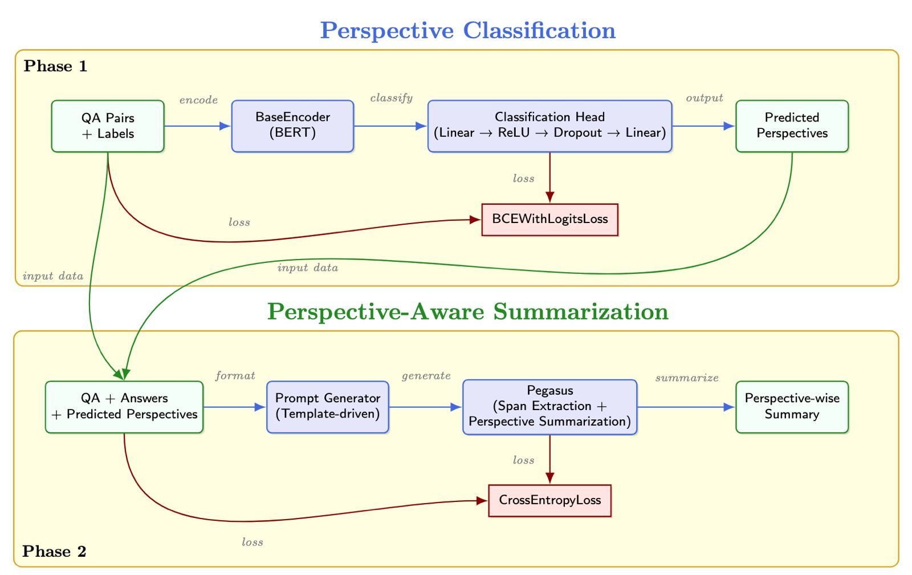

# HealthScribe3000: Perspective-Aware Summarization in Healthcare QA

[](./LICENSE)
[](https://github.com/theshamiksinha)
[](https://www.python.org/downloads/)
[](https://huggingface.co/)

HealthScribe3000 is a **multi-phase framework** that performs _perspective classification_ followed by _perspective-aware summarization_ of healthcare QA answers. It aims to provide **summaries that are aware of context, tone, and intent**, inspired by real-world medical communication needs.

## 🔍 Project Motivation

In healthcare, different answers to the same question can reflect various **perspectives** such as:

- 💡 **Information** — factual statements
- 🎯 **Suggestion** — advice or instructions
- ⚠️ **Cause** — reasons or explanations
- ✅ **Query** — affirming a question
- ❌ **Experience** — sharing own experience

This project provides a pipeline that:
1. Identifies such perspectives in QA pairs using BERT-based classification.
2. Generates summaries for each detected perspective using a fine-tuned Pegasus model with structured prompts.

## 🌐 System Architecture



### Phase 1 — **Perspective Classification**
- Encodes QA pairs using a BERT-based encoder
- Predicts perspective labels using a linear classification head
- Trained with `BCEWithLogitsLoss`

### Phase 2 — **Perspective-Aware Summarization**
- Constructs prompts with QA, answer, and predicted perspectives
- Uses Pegasus to extract perspective-specific spans and summarize them
- Trained with `CrossEntropyLoss`

## 🗂️ Repository Structure

```
HEALTHSCRIBE3000/
└── multiperspect_health/
    ├── A. Project Proposal & Baseline/
    ├── config/
    ├── data/
    ├── inference/
    ├── models/
    ├── modules/
    ├── saved_models/
    ├── training/
    ├── utils/
    ├── main.py
    ├── requirements.txt
    ├── .gitignore
    ├── architecture.jpeg
    └── README.md
```

## 🧪 Dataset

We use a custom dataset of **3167 healthcare questions** and **9987 answers**, each annotated with:
- **Answer spans** for each perspective
- **Perspective-wise summaries**

Files:
- `train.json`, `valid.json`, `test.json` in `/data/`

## 🚀 Getting Started

### 1. Clone & Install

```bash
git clone https://github.com/theshamiksinha/HealthScribe3000.git
cd HealthScribe3000
pip install -r requirements.txt
```

### 2. Run the Complete Pipeline

The entire pipeline can be executed with a single command:

```bash
python main.py
```

This will:
1. Train or load the perspective classifier
2. Predict perspectives on the test dataset
3. Train or load the summarization model
4. Generate perspective-aware summaries

Alternatively, you can run individual components:

#### Train the Perspective Classifier

```bash
python training/train_classifier.py --config config/config.yaml
```

#### Fine-tune the Summarizer (Pegasus)

```bash
python training/train_llm.py --config config/config.yaml
```

#### Evaluate on Test Set

```bash
python inference/evaluate_summariser.py --config config/config.yaml
```

## 🧠 Core Technologies

| Module | Model / Technique |
|--------|-------------------|
| Perspective Classification | BERT + Linear Layers |
| Summarization | Pegasus |
| Prompting Style | Template-based |
| Span Extraction | Implicit via generated prompt |
| Loss Functions | BCEWithLogits, CrossEntropy |
| Evaluation | ROUGE, BLEU, METEOR, BERTScore |

## 📊 Metrics

You can find post-training metrics under:

```
/eval_after_training/metrics.txt
```

Includes:
- ROUGE-1, ROUGE-2, ROUGE-L
- BLEU
- METEOR
- BERTScore

## 📎 Example Prompt

```
Summarize the responses to the health question below. 

Focus on highlighting insights from the SUGGESTION perspective. Use a Advisory, Recommending. tone. 

Be clear and concise. Perspective Definition: Advice or recommendations to assist users in making informed medical decisions, solving problems, or improving health issues.

Question: What is the treatment for gestational diabetes?
Answer: Treatment involves healthy eating and regular physical activity...

```


## 🔮 Future Work

- Extending the model to handle multilingual healthcare content
- Incorporating domain-specific medical knowledge bases
- Building an interactive demo for clinical usage
- Exploring few-shot capabilities for rare medical conditions

## 🧑‍💻 Contributors

- Shamik Sinha – [@theshamiksinha](https://github.com/theshamiksinha)
- Vansh Yadav – [@vansh22559](https://github.com/vansh22559)
- Shrutya Chawla – [@shrutya22487](https://github.com/shrutya22487)

## 📜 License

This project is licensed under the MIT License - see the [LICENSE](./LICENSE) file for details.

## 🌟 Show Your Support

If you find this useful, leave a ⭐ on GitHub!